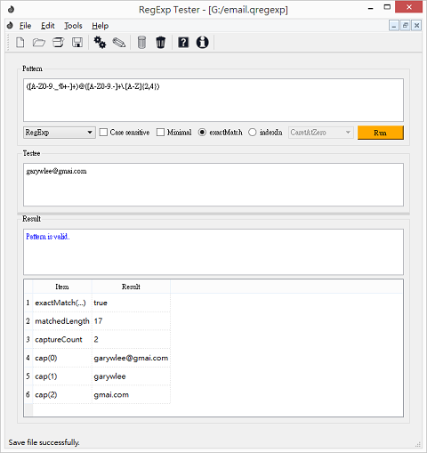

QRegExpTester
=============

A testbench utility for the QRegExp of Qt toolkit.

QRegExpTester provides a convenient utility to write and test QRegExp class.
With this utility, you can test your regular expression with testee string and
check the result which generated from QRegExp class. 

You don't have to recompile your code repeatedly to tune the regular expression.

